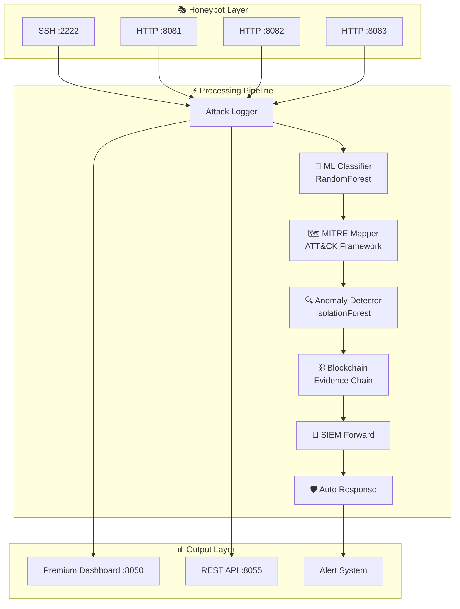

# 🦎 Chameleon — Advanced Cyber Deception Framework

<div align="center">


**Enterprise-grade cyber deception framework with AI-powered threat intelligence,
blockchain-based forensic evidence, and MITRE ATT&CK mapping.**

[Features](#-features) · [Quick Start](#-quick-start) · [Architecture](#-architecture) · [Dashboard](#-dashboard) · [API](#-api-reference) · [MITRE Coverage](#%EF%B8%8F-mitre-attck-coverage)


</div>

---

## 🚀 Features

### 🤖 Machine Learning Threat Intelligence
- **Real-time Attack Classification** using `RandomForestClassifier` trained on 2,000+ attack patterns
- **Anomaly Detection** with `IsolationForest` for zero-day threat identification
- **Behavioral Profiling** — attacker skill assessment and next-attack prediction
- **Auto-retraining** on new attack data for continuous model improvement

### 🗺️ MITRE ATT&CK Framework Mapping
- Maps all detected attacks to **14+ ATT&CK techniques** across **9 tactics**
- Kill chain progression tracking (Reconnaissance → Exfiltration)
- **ATT&CK Navigator JSON export** for threat intelligence sharing
- Heatmap visualization of technique coverage

### ⛓️ Blockchain Evidence Chain
- **Immutable attack evidence** stored in local blockchain
- SHA-256 hash chain with integrity verification
- Court-admissible digital forensics capability
- Evidence tampering detection

### 🎭 Advanced Honeypot Network
- **SSH Honeypot** — Credential capture with realistic OpenSSH emulation
- **HTTP Honeypots** — SQL Injection, XSS, Path Traversal, Command Injection detection
- **Dynamic Personality Switching** — Mimics Windows Server, Ubuntu, IoT devices
- **Distributed multi-node** architecture (local, cloud, DMZ)

### 📊 Premium Real-Time Dashboard
- Stunning cyberpunk-themed UI with glassmorphism design
- **Live Attack Timeline** — Real-time frequency chart
- **Global Attack Map** — Geographic visualization of attack origins
- **MITRE ATT&CK Heatmap** — Technique coverage display
- **Threat Level Gauge** — Dynamic threat assessment meter
- Mobile-responsive design

### 🛡️ Enterprise Integration
- **SIEM Integration** — Elasticsearch, Splunk, Syslog compatible
- **REST API** — Full programmatic access with pagination and filtering
- **Automated Response** — AI-driven IP blocking, rate limiting, network isolation
- **Alert System** — Email, SMS (Twilio), Webhook notifications
- **Docker Deployment** — Production-ready containerization

---

## 📐 Architecture



---

## ⚡ Quick Start

### Option 1: Direct Run

```bash
# Clone the repository
git clone https://github.com/yourusername/chameleon-cyber-deception.git
cd chameleon-cyber-deception

# Create virtual environment
python3 -m venv venv
source venv/bin/activate

# Install dependencies
pip install -r requirements.txt

# Run the framework
python3 main.py
```

### Option 2: Docker

```bash
# Build and run with Docker Compose
docker-compose up -d

# View logs
docker-compose logs -f chameleon
```

### Access Points

| Service | URL | Description |
|---------|-----|-------------|
| 📊 Dashboard | http://localhost:8050 | Premium real-time dashboard |
| 📡 REST API | http://localhost:8055/api/v1/stats | API endpoints |
| 🔐 SSH Honeypot | `ssh root@localhost -p 2222` | SSH honeypot |
| 🌐 HTTP Honeypots | http://localhost:8081-8083 | HTTP honeypots |

---

## 🎯 Usage & Testing

### Attack Simulation

```bash
# SSH Brute Force Simulation
ssh root@localhost -p 2222

# SQL Injection Attempt
curl "http://localhost:8081/login.php' OR '1'='1'--"

# XSS Attack
curl "http://localhost:8082/<script>alert('XSS')</script>"

# Path Traversal
curl "http://localhost:8083/../../etc/passwd"

# Command Injection
curl "http://localhost:8081/exec.php?cmd=whoami"

# Reconnaissance
curl http://localhost:8082/.env
curl http://localhost:8081/robots.txt
```

---

## 📡 API Reference

### Get System Statistics
```bash
GET /api/v1/stats
```
```json
{
  "total_attacks": 150,
  "unique_ips": 15,
  "blockchain_blocks": 30,
  "blockchain_valid": true,
  "ml_accuracy": 87.5,
  "mitre_techniques": 12,
  "siem_events": 150,
  "nodes": 3
}
```

### Get Attacks (Paginated)
```bash
GET /api/v1/attacks?page=1&per_page=20&type=SQL_INJECTION
```

### Get MITRE ATT&CK Coverage
```bash
GET /api/v1/mitre
```

### Export ATT&CK Navigator JSON
```bash
GET /api/v1/mitre/navigator
```

### Get ML Model Statistics
```bash
GET /api/v1/ml/stats
```

### Get Blockchain Status
```bash
GET /api/v1/blockchain
```

---

## 🗺️ MITRE ATT&CK Coverage

| Tactic | Technique ID | Technique Name | Detection |
|--------|-------------|----------------|-----------|
| Reconnaissance | T1595 | Active Scanning | ✅ Port Scan Detection |
| Reconnaissance | T1592 | Gather Victim Host Info | ✅ OS Fingerprinting |
| Initial Access | T1110 | Brute Force | ✅ SSH/HTTP Brute Force |
| Initial Access | T1190 | Exploit Public-Facing App | ✅ SQLi, XSS, RCE |
| Initial Access | T1078 | Valid Accounts | ✅ Credential Capture |
| Execution | T1059 | Command & Scripting | ✅ Command Injection |
| Discovery | T1046 | Network Service Discovery | ✅ Port Scanning |
| Discovery | T1082 | System Info Discovery | ✅ Fingerprinting |
| Lateral Movement | T1021 | Remote Services | ✅ SSH Monitoring |
| Collection | T1005 | Data from Local System | ✅ Path Traversal |
| Exfiltration | T1041 | Exfiltration Over C2 | ✅ Data Transfer Monitoring |
| Impact | T1499 | Endpoint DoS | ✅ Flood Detection |

---

## 🧪 Testing

```bash
# Run all tests
pytest tests/ -v

# Run with coverage
pytest tests/ -v --cov=modules --cov-report=term-missing

# Run specific test suite
pytest tests/test_attack_classifier.py -v
pytest tests/test_mitre_mapping.py -v
pytest tests/test_blockchain.py -v
```

---

## 📦 Project Structure

```
chameleon-cyber-deception/
├── main.py                          # Main orchestrator
├── requirements.txt                 # Python dependencies
├── Dockerfile                       # Container build
├── docker-compose.yml               # Full stack deployment
├── README.md                        # This file
│
├── modules/
│   ├── ai/
│   │   ├── attack_classifier.py     # ML attack classification (RandomForest)
│   │   ├── anomaly_detector.py      # Anomaly detection (IsolationForest)
│   │   ├── mitre_mapping.py         # MITRE ATT&CK framework mapping
│   │   ├── threat_analyzer.py       # Threat analysis engine
│   │   └── demo_data.py             # Realistic demo data generator
│   ├── deception/
│   │   ├── ssh_emulator.py          # Advanced SSH honeypot
│   │   └── http_emulator.py         # Advanced HTTP honeypot
│   ├── defense/
│   │   └── auto_blocker.py          # Automated IP blocking
│   ├── evidence/
│   │   └── blockchain_store.py      # Blockchain evidence storage
│   └── notifications/
│       └── alert_system.py          # Multi-channel alerts
│
├── web/
│   └── dashboard_premium.py         # Premium Plotly/Dash dashboard
│
├── core/
│   ├── engines/
│   │   └── deception_engine.py      # Core deception engine
│   └── distributed_node.py          # Distributed network node
│
├── config/
│   └── config.yaml                  # Framework configuration
│
├── data/
│   └── logs/                        # Attack logs
│
├── tests/
│   ├── test_attack_classifier.py    # ML classifier tests
│   ├── test_mitre_mapping.py        # MITRE mapping tests
│   └── test_blockchain.py           # Blockchain tests
│
└── deployment/
    ├── install.sh                   # Installation script
    └── quick_install.sh             # Quick setup
```

---

## 🤝 Contributing

1. Fork the repository
2. Create your feature branch (`git checkout -b feature/amazing-feature`)
3. Commit your changes (`git commit -m 'Add amazing feature'`)
4. Push to the branch (`git push origin feature/amazing-feature`)
5. Open a Pull Request

---

## ⚠️ Legal Disclaimer

> This framework is designed for **authorized security testing and educational purposes only**.
> - Use only on networks you own or have explicit written permission to test
> - Comply with all applicable laws and regulations
> - Users are solely responsible for their actions
> - The developers are not liable for any misuse or damage

---

## 📄 License

This project is licensed under the MIT License — see the [LICENSE](LICENSE) file for details.

---

<div align="center">

**Built with ❤️ for the Cybersecurity Community**

⭐ Star this repo if you find it useful!

</div>
